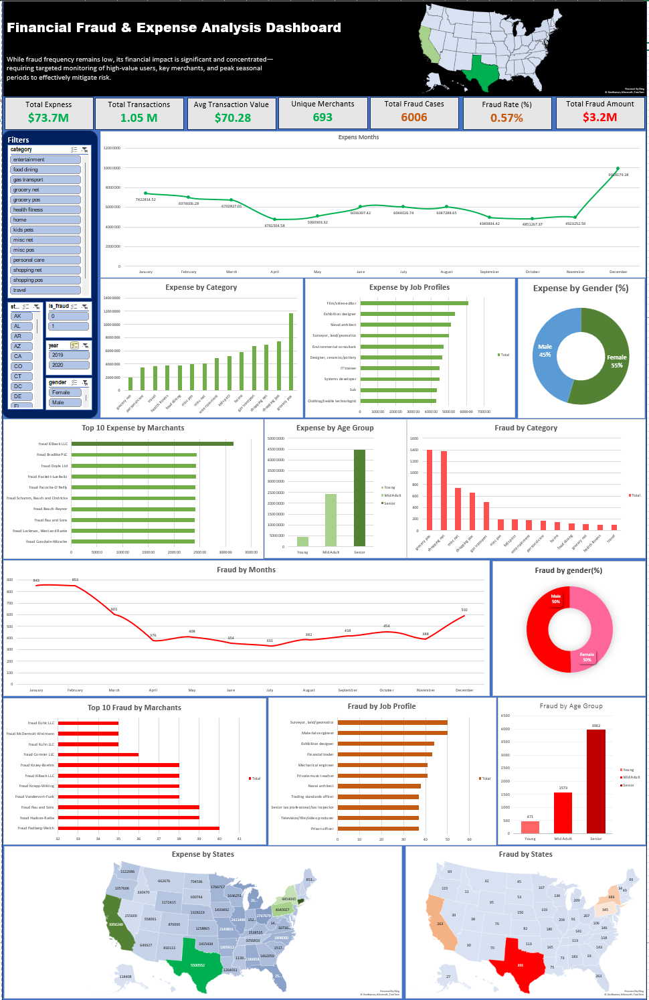

# 📊 Financial Fraud & Expense Analysis Dashboard (Excel)
This project presents an interactive Excel dashboard designed to analyze financial transactions, spending behavior, and fraud patterns.

The dashboard highlights key insights such as fraud impact, customer segmentation, seasonal trends, and geographic risk distribution.

---

## 📌 Key Features

- KPI Tracking:
  - Total Revenue ($73.7M)
  - Total Transactions (1.05M)
  - Avg Transaction Value ($70.28)
  - Fraud Rate (0.57%)
  - Total Fraud Amount ($3.2M)

- Interactive Filters:
  - Year
  - Category
  - State
  - Gender
  - Fraud Flag

- Visual Analysis:
  - Monthly Expense Trend
  - Expense by Category
  - Top Merchants Analysis
  - Fraud Trend by Month
  - Gender & Age Group Insights
  - State-wise Expense & Fraud Maps

---

## 📊 Key Insights

- Fraud is low in frequency (~0.57%) but high in value (~$3.2M)
- Significant spending occurs during year-end (December peak)
- Senior age group contributes highest spending and fraud risk
- Fraud is concentrated among specific merchants and regions
- High-transaction states (CA, TX, NY) show higher fraud exposure

---

## 🛠 Tools Used

- Microsoft Excel
- Pivot Tables
- Pivot Charts
- Slicers & Filters
- Conditional Formatting
- Map Charts

---

## 📁 Dataset

- Source: Kaggle (Credit Card Transactions Dataset)
- Includes transaction-level data such as:
  - Amount
  - Merchant
  - Location
  - Fraud flag

---

## 🚀 How to Use

1. Download the Excel file
2. Open in Microsoft Excel
3. Use slicers to filter data dynamically
4. Explore insights across charts and maps

---

## 💡 Project Purpose

This project demonstrates:
- Data cleaning & transformation
- Business insight generation
- Dashboard design & storytelling
- Fraud analysis use-case

---

## Dashboard Preview:

---
## file on request
roshan.yadav3711@gmail.com

⭐ If you like this project, feel free to give it a star!
